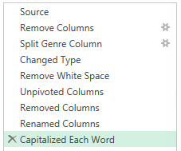
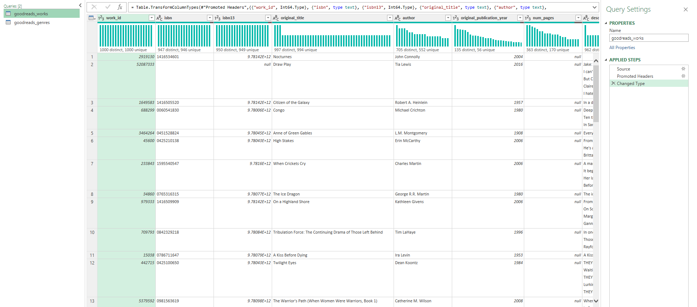
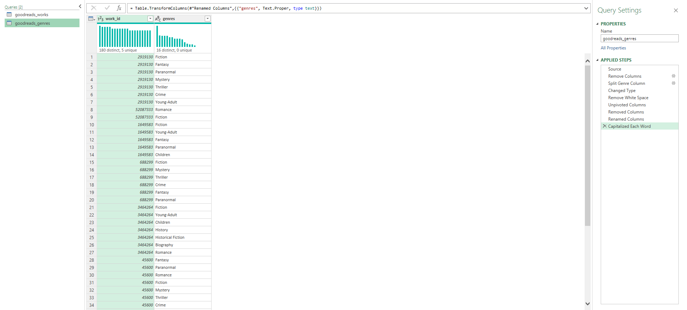
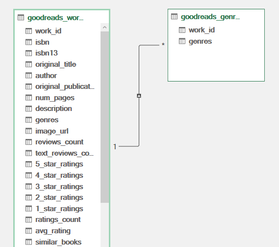

# Goodreads Data Analysis

## Introduction

This project explores book ratings and genre trends using Goodreads data. I chose this dataset because it provides a large and diverse collection of information, making it ideal for examining patterns and trends. I also chose it out of personal interest as it reflects real reader opinions, making it engaging to analyse. 


### Questions To Analyse 

To better understand the data, the following questions were asked:

- Which authors have received the greatest number of ratings, and how many of these are 5-star ratings?
- Which authors have the greatest proportion of 5-star ratings, and how does this compare to their total rating counts?
- How are average ratings distributed across books? 
- What are the most popular genres on Goodreads?
- How does book length vary across genres?

### Excel Skills Used

Throughout this project, I developed and refined my skills in Excel in the following areas:

- PivotTables
- PivotCharts 
- DAX (Data Analysis Expression)
- Power Query 
- Power Pivot

### Goodreads Dataset

The dataset used for this project is from the [University of California San Diego](https://cseweb.ucsd.edu/~jmcauley/datasets/goodreads.html), and contains real-world data from Goodreads collected in 2017.

It includes information on:
- Book Titles
- Authors
- Average Ratings
- Rating Counts
- Genres 

## Pre-Analysis

#### Extract: 

I used Power Query to extract the data `(goodreads_works.csv)` and created two queries containing:  
1. All goodreads data (`goodreads_works`)  
2. Genres for each work ID (`goodreads_genres`)

#### Transform:

I transformed the second query by selecting only the columns of `work_id` and `genres`. The latter was split into separate columns, one for each genre, and unpivoted so each was in a row alongside the corresponding work ID.

- goodreads_genres transformation  
 

The entries were also cleaned by removing white space and by capitalising each word.

#### Load:

Next, I loaded the queries into the workbook.

- goodreads_works
 


- goodreads_genres
 

#### Data Model: 

As the genres were relative to each book, in Power Pivot  I created a relationship between the two tables using the `work_id` column.

- Power Pivot Data Model  


## Which authors have received the greatest number of ratings, and how many of these are 5-star ratings?

#### Analysis:
- I created a __PivotTable__ using the columns `author`, the sum of `ratings_count` and the sum of `5-star ratings`.
- I then filtered this to only include the authors with the greatest number of ratings and visualised the result using a __PivotChart__

#### Results: 


#### Insights:
- __J.K. Rowling__ has the greatest number of ratings by a wide margin, along with a large proportion of 5-star ratings, suggesting positive reader reception.
- __J.K. Rowling__, __Suzanne Collins__ and __Stephenie Meyer__ are outliers, receiving upwards of 8 million ratings each, indicating their status as widely recognised authors.
- __Dan Brown__ and __William Shakespeare__ have a smaller proportion of 5-star ratings which may reflect divided reader opinion.

## Which authors have the greatest proportion of 5-star ratings, and how does this compare to their total rating counts?

#### Analysis:

- I created a __PivotTable__ with the columns of `author` and sum of `ratings_count`
- I added a new measure using __DAX__ to calculate the proportion of 5-star ratings that each author received:  
```=DIVIDE([Sum of 5_star_ratings],[Sum of ratings_count])```
- I then filtered this to include authors with the greatest proportion of 5-star ratings and plotted this using a __PivotChart__

#### Results: 


#### Insights:

- Authors who receive the __highest proportion of 5-star ratings__ (e.g. Robert Their. T.M. Frazier) are __not the same__ as those who have the most ratings overall.
- While these authors received positive feedback, they tend to have __smaller audiences__.
- Conversely, authors with __larger numbers of ratings__ have a __reduced proportion of 5-star reviews__, suggesting that with increased popularity, rating averages tend to reduce.

## How are average ratings distributed across books?

#### Analysis:

- I added a new column to the `goodreads_works` query using __Power Pivot__ to round the `avg_rating` values to one decimal place:  
```=ROUND(goodreads_works[avg_rating],1)```
- I then entered this measure into a __PivotTable__ alongside its count to visualise the distribution of average ratings.

#### Results: 


#### Insights:

- __Average ratings are between 3.5 and 4.5__ with a peak around __4.0__, indicating positive reception for most books.
- __Few books received particularly low or high averages__ indicating extreme opinions are rare when averaged across many readers.

## What are the most popular genres on Goodreads?

#### Analysis:

- Using the `goodreads_genres` query, I created a __PivotTable__ containing each genre and its corresponding count.
- I then used a __PivotChart__ to visualise the distribution of genres based on their frequency.

#### Results: 


#### Insights:

- __Fiction is the most represented genre__ on Goodreads with around __13,000__ entries.
- __Romance__ follows behind fiction indicating it is one of the most popular genres on Goodreads.
- __Non-Fiction genres__ (Biography, History, Non-Fiction and Poetry) all appear to a reduced degree showing a __bias for fictional works__. 

## How does book length vary across genres?

#### Analysis:

- I created a measure to calculate the median page count:  
```=MEDIAN([num_pages])``` 
- Then, using that measure, I calculated the median page count of each genre:  
```=CALCULATE([median_num_pages], CROSSFILTER(goodreads_genres[work_id],goodreads_works[work_id], Both))```
- I entered this into a __PivotTable__ alongside `genre` and displayed this data in a __PivotChart__.

#### Results: 


#### Insights:

- __Non-Fiction books__ (Biography, History) have the __highest median page counts__. 
- __Romance__ and __Young Adult__ books are __shorter on average__ indicating a tendency toward accessible reads that appeal to wide audiences.
- __Children's books__, __Poetry__ and __Graphic novels__ have a __significantly lower median page count__ (around 180-250 pages) reflecting different storytelling formats.