# UFO Sightings Interactive Dashboard

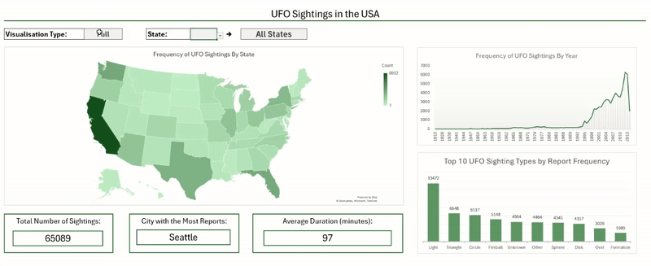

## Introduction

This project explores UFO sightings across the USA from 1910 to 2014. The objective was to understand how these differ across regions, to identify long-term trends, to compare types of sightings and to understand which states report the most activity. 

## Dashboard file

The dashboard can be found here [USA_UFO_Dashboard.xlsx](USA_UFO_Dashboard.xlsx)

## Excel Skills Used

Throughout this project, I developed and refined my skills in Excel in the following areas:

- Charts
- Formulas and Functions
- Data Validation

## UFO Sightings Dataset

The dataset used for this project contains real-world reported UFO Sightings provided by the National UFO Reporting Center (NUFORC) and can be accessed [here](https://www.kaggle.com/datasets/NUFORC/ufo-sightings).

It includes information on sightings such as the:
- Exact date
- State
- Duration 
- Type 

## Dashboard Build 

This dashboard is interactive as follows: 
- When __Full__ is selected, data from across the USA is displayed:  
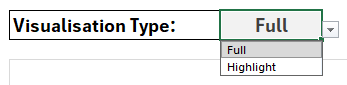

- When __Highlight__ is selected, the user is able to then select a specific state to see the same statistics specific to that region:  
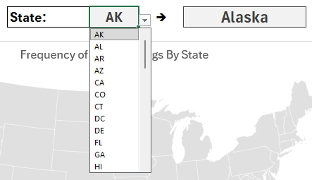

## Charts 

### Full - Choropleth Map of UFO Sightings

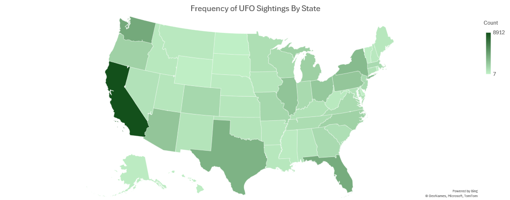

__Analysis:__
- Utilised Excel's map chart feature to plot the number of sighting recorded in each state.
- The choropleth map format allows for easy visual comparison between regions, highlighting geographic patterns in reporting.

__Insights__:

- __California__ can easily be identified as having the highest number of UFO sighting reports.
- Other states with comparatively high counts include __Washington__, __Texas__ and __Florida__.

### Highlight - Map of UFO Sightings

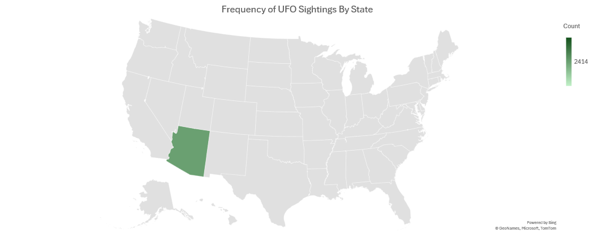

__Insights__:
- Only the selected state is highlighted.
- The exact count of sightings for the chosen state is displayed in the legend to the right of the map.

__Background Table__:

This map updates dynamically based on whether __Full__ or __Highlight__ mode is selected.

- When a state is selected, the underlying dataset updates so the map displays only the relevant information.
- The ```state_count``` column uses the following formula:  
```=IF(type="Full", $D2, IF(state=$B2,$D2,NA()))```  
- If `Full` is selected, all states retain their sighting counts. 
- When `Highlight` is selected, only the chosen state keeps its value; all others return `N/A`, ensuring only one state appears on the map.

The image below shows the table with 'Highlight' and 'Arizona' selected:  
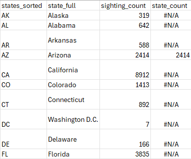

### Reports Over Time 

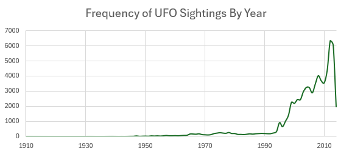

__Analysis__:

- A line chart was used to show how UFO sightings have changed over time.
- This type of chart is effective at highlighting long-term trends and identifying periods of growth or decline in reporting.

__Insights__:

- There were __very few UFO Sightings recorded before 1994__, after which the number of reports increased sharply.
- __The peak year for sightings was 2013__, which has the highest number of report in the timeline.

__Background Table__:

This visualisation updates dynamically depending on whether __Full__ or __Highlight__ mode is selected.

The steps used to create the table were:

- Retrieve the frequency of sightings for each year across all states.
- Filter this column to include the number of sightings for the selected state:   
```=COUNTIFS(data[year],$B2,data[state],state)```
- The final column selects which value should be displayed in the chart:  
```=IF(type="Full",$C2,$E2)``` 
    - If `Full` is selected, the full dataset counts are shown.
    - If `Highlight` is selected, only the selected state's yearly counts are displayed.
    
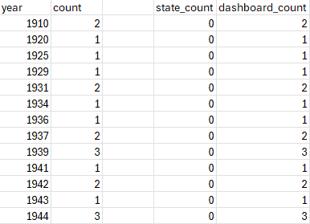

### Type of Sighting

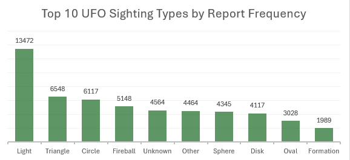

__Analysis__:
- A bar chart was used to display the frequency of each reported UFO shape
- This allows for clear comparison between shape types and highlights which forms are most commonly reported 

__Insights__:

- __Light__ is by far the most frequently reported shape with roughly twice as many sightings as any other category.
- __Triangle__ and __Circle__ are the second and third most common shapes reported.
- Approximately __4500__ reported listed the UFO Shape as unknown, indicating that many observers could not determine the object's form.

__Background Table Logic__:

This visualisation updates dynamically depending on whether __Full__ or __Highlight__ mode is selected.

The steps used to create the table were:

- Calculate total counts for each shape across the entire dataset and store the values in the count column.
- Calculate state-specific counts for the selected state and store them in the state count column.
- Select the appropriate value based on the chosen view:  
```=IF(type="Full", $B2, $C2)```  
This formula populates `dashboard_count` with either the full dataset count or the selected state’s count.
- Sort shapes in descending order based on the selected count:      
```=SORTBY(CHOOSE({1,2}, A2:A30, D2:D30), D2:D30, -1)```

This produces a sorted table pairing each shape with its frequency.

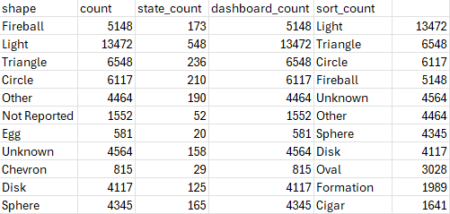

## Metric Cards

__Full__:  
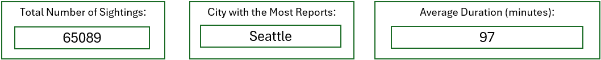

__Highlight (Arizona)__:  


Metric cards were added to the dashboard to provide clear insights at a glance. They update dynamically depending on the selected view: 
- When `Full` is selected, the cards summarise information across all states.
- When `Highlight` is selected, they display statistics for the chosen state only.

The cards report three key metrics:
- Total number of sightings 
- The city with the greatest number of reported sightings
- The average duration of sightings

__Total Number of Sightings__:

This value is calculated by summing values in the `state_count` column:  
```=SUM(IF(ISNUMBER(E2:E52),E2:E52))```

This ensures only valid numerical entries are included in the total.

__City with the Most Reports__:

To identify the city with the highest number of sightings:
- Store the currently selected state in cell `J2`:     
```=state```
- Populate a column with a list of cities depending on the selected view:  
```=IF(type="Full",data[city],FILTER(data[city],data[state]=J2))```
- Count each unique city and sort in descending order:  
```=SORTBY(UNIQUE(K2#), COUNTIF(K2#, UNIQUE(K2#)), -1)```

This produces a list with the most frequently reported city at the top.

__Average Duration (minutes)__:

To calculate the average duration of sightings:
- Retrieve either all duration values or only those from the selected state:  
```=IF(type="Full", data[duration (seconds)], FILTER(data[duration (seconds)],data[state]=State!J2))```
- compute the average (in seconds) and convert to minutes:   
```=AVERAGE(A2#)/60```
